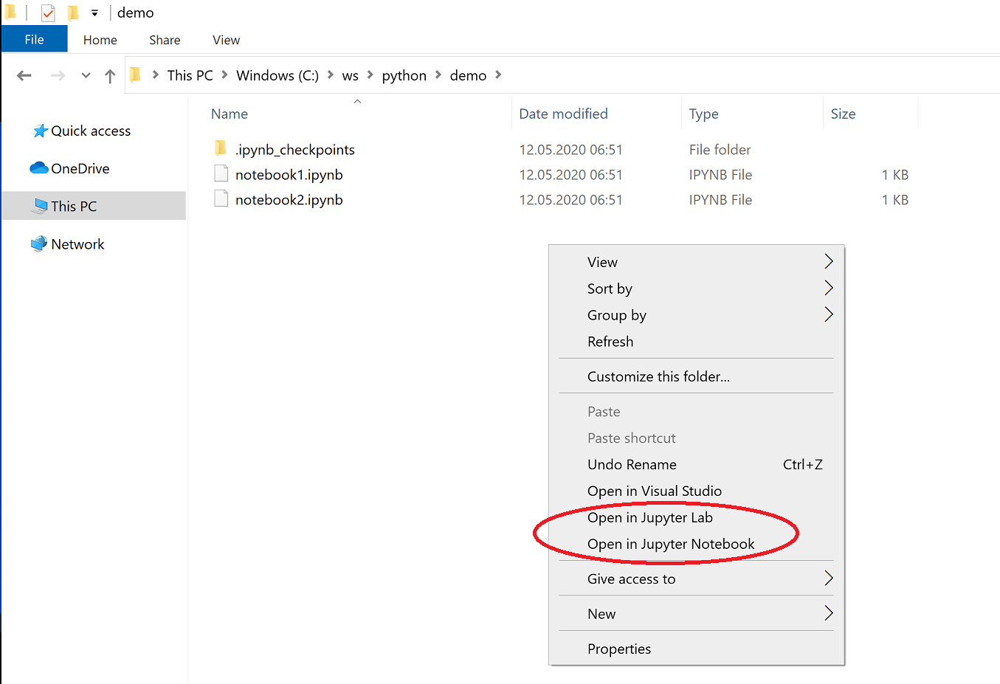

# JupyterLabWindowsContextMenuItem

Registry files for Jupyter Lab and Jupyter Notebook for adding them to the context menu in Windows. Jupyter notebook is opened in the current directory.

After installation, the Windows context menu appears as:

## Setup

Run the registry files for adding the registry keys:
- "jupyter_lab_cmi.reg" file for adding the **Jupyter Lab** context menu item,
- "jupyter_notebook_cmi.reg" file for adding **the Jupyter Notebook** context menu item.
